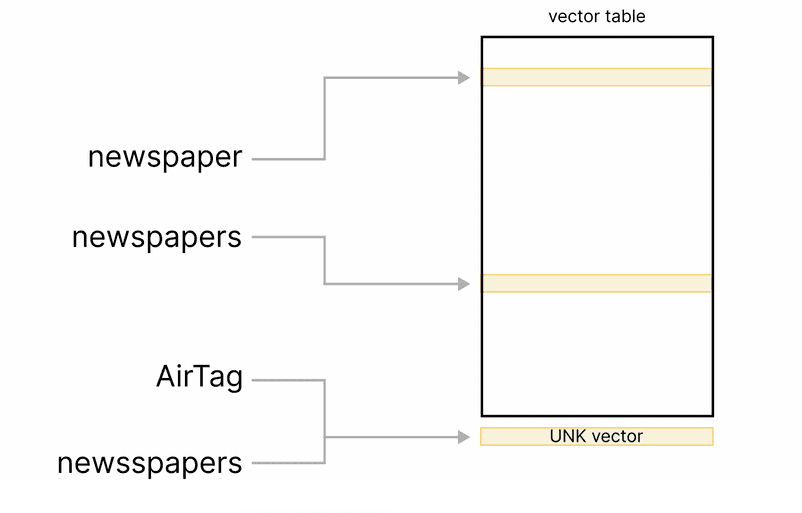
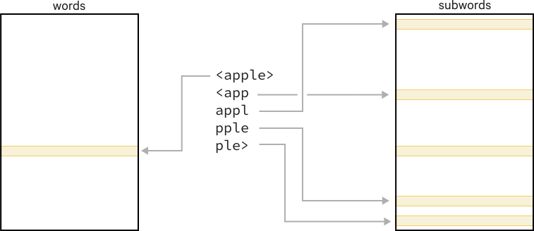
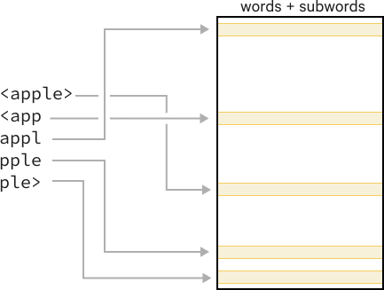
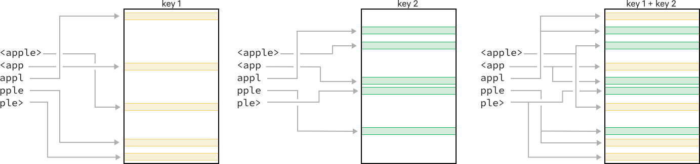
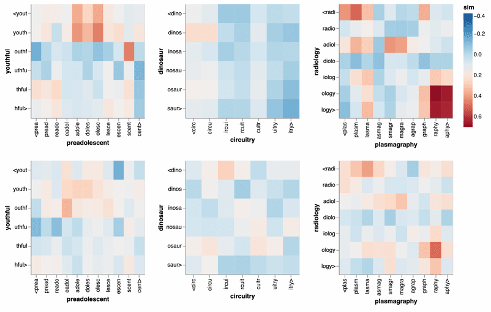

# floret：轻量级的、稳健的单词向量

floret是fastText的一个扩展版本，它使用Bloom嵌入来创建包含单词和子词信息的紧凑向量表。floret将fastText的子词带入spaCy管道，其向量比传统单词向量小10倍。

在这篇博文中，我们将深入研究这些向量。我们将解释它们是如何工作的，并展示它们在什么时候是有用的。如果你已经熟悉了floret的工作方式，请跳到fastText与floret的比较。


## **向量表**

对于许多向量表，包括spaCy中的默认向量，向量表包含一个固定的单词列表的条目，通常是训练数据中最常见的单词。向量表会有像*newspaper* 和*newspapers*这样的词条，它们在向量上是相似的，但每个词条都作为一个完全独立的行存储在表中。

由于向量表中的单词数量有限，在某些时候，你会遇到一些不常见的、新奇的或嘈杂的单词，如newsspaper或doomscrolling，这些单词在训练中并没有出现。通常情况下，有一个特殊的未知向量用于这些词，在spaCy中是一个全零的向量。因此，虽然报纸和报纸的向量是相似的，但newsspaper的向量看起来完全不同，再加上它的全零向量使它看起来与其他所有的未知词相似，如AirTag或someverylongdomainname.com。




为已知词和未知词提供更有用的向量的一个选择是纳入子词信息，因为像news和paper这样的子词可以用来将newspaper这样的词的向量与newsspaper这样的已知词和未知词联系起来。我们将看看fastText如何使用子词信息，解释floret如何扩展fastText以保持向量表的大小，并探讨floret向量的优势。


## 具有子词信息的向量

fastText使用字符n-gram子词：一个词的最终向量是全词的向量和所有子词的向量的平均值。例如，苹果的向量有4个格子词，它的向量是以下字符串的向量的平均值（<和>作为词的边界字符被添加）:


```
<apple>, <app, appl, pple, ple>
```

fastText也支持一系列的n-gram大小，所以用4-6-grams，你会有:

```
<apple>, <app, appl, pple, ple>, <appl, apple, pple>, <apple, apple>
```

通过使用子词，fastText模型可以为以前未见过的标记提供有用的向量，如通过使用<新闻和报纸>这样的子词。与单一的UNK-向量相比，带有子词的fastText模型可以为不常出现的、新奇的和有噪音的词提供更好的表示。

有很多情况都能从子词信息中受益:

#### 案例1：有许多后缀的词

像芬兰语、匈牙利语、韩语或土耳其语这样的语言可以通过在单一词干上添加大量的后缀来构建单词。

```
Hungarian

kalap+om+at (‘hat’ + POSSESSIVE + CASE: ‘my hat’, accusative)
```

例如，一个匈牙利名词最多可以有五个与数量、占有和大小写有关的后缀。仅以上面的例子为例，如果正好有两个后缀，就有6个占有式词尾（单数/复数×第一/第二/第三人称）和18种情况，从而导致108种不同形式的卡拉普，而在英语中，向量表中只有两种形式，即帽子和笠帽。


### 案例2：有许多转折词的单词


有些语言的每个词干有大量的转折形式。

```
Finnish

Inflected forms of valo (‘light’) include: valo, valon, valoa, valossa, valosta, valoon, valoon, valolla, valolta, valolle, … and we haven’t even gotten to the plural forms yet.
```


在芬兰语中，许多名词的转折形式与英语中使用介词的短语相对应，如 "in the light"、"with the light"、"as a light"、"of the lights"，等等。因此，英语向量需要两个条目来表示'光'和'灯'，而芬兰语向量可能有20多个条目来表示'光'的不同形式，你通常不会在训练数据中看到每个词的所有可能形式。捕获部分词干（如valo）和后缀（如lle>）的子词可以帮助为以前未见过的词提供更有意义的向量。

### 案例3：长复合词


一些语言，如德语和荷兰语，通过构建很长的单字形成复合词。

```
German

Bundesausbildungsförderungsgesetz (‘Federal Education and Training Assistance Act’)
```

长的复合词往往可能是新的或非常不常见的，因此化合物中每个单元的子词都能改善向量，例如Bund, ausbild, förder, gesetz（'联邦'、'教育'、'协助'、'法律'）。

### 案例4：拼写错误和新词

```
English

univercities (vs. universities), apparrently (vs. apparently)
tweetstorm, gerrymeandering
```

嘈杂和新奇的词汇包含与相关的已知词汇重叠的子词，如 apparent, university 和 gerrymander。


## 在spaCy中添加子词支持

在内部，fastText将词和子词向量存储在两个独立的大表中。通常导入spaCy管道的.vec文件只有单词表，所以尽管在训练fastText向量时可能使用了子词，但默认的spaCy管道最终只支持单词表的固定大小的词汇，而不支持通过子词的词汇外标记。



一种可能性是直接支持spaCy中的大型子字表，但这将使spaCy管道膨胀到2GB以上的典型配置。由于这是不现实的，我们转向Thinc和spaCy已经使用的方法。布隆嵌入。通过Bloom嵌入，我们既可以支持子词，又可以大大减少向量表的大小。

我们通过扩展fastText来实现floret，增加这两个选项:


- **将字和子字向量都存储在同一个哈希表中**

  

- **将每个条目散列成多行，以便能够减少散列表的大小**




让我们比较一下fastText和floret向量，并探索紧凑型floret向量的优势!

### 词汇中的fastText与floret的比较

fastText和floret之间最大的区别是向量表的大小。有了floret，我们从200-300万个向量变成了<20万个向量，这就把向量的大小从3GB减少到<300MB。floret的已知词的向量看起来还和原来的fastText向量相似吗？

为了直接比较，我们在相同的英文文本上训练了fastText和floret向量，以便能够同时查看单词和子词向量。

首先，我们要看一下相关和不相关词汇中的子词对的余弦相似度:



上面一行显示了fastText的子词之间的余弦相似度。底部一行显示的是floret的情况。


我们可以看到，尽管使用了一个小得多的散列表，floret还是保持了子词之间的关联性。尽管对于floret向量来说，余弦相似度总体上更接近于0，但热图对于个别的子词对来说显示出非常相似的模式，比如右面例子中深红色的rapy和ology表示相关后缀之间的相似性，或者中间例子中白色的不相关的子词circu和osaur。

接下来，我们要看一下已知词的最相似词。

```
Example: dinosaur
fastText	score	floret	score
dinosaurs	0.916	dinosaurs	0.886
stegosaur	0.890	Dinosaur	0.784
dinosaurian	0.888	Dinosaurs	0.758
Carnosaur	0.861	dinosaurian	0.728
titanosaur	0.860	Carnosaur	0.726
```

```
Example: radiology
fastText	score	floret	score
teleradiology	0.935	Radiology	0.896
neuroradiology	0.920	teleradiology	0.870
Neuroradiology	0.911	Neuroradiology	0.865
radiologic	0.907	radiologic	0.859
radiobiology	0.906	radiobiology	0.840

```

对于所有这些例子，我们可以确认，虽然来自floret的近邻和fastText的近邻之间存在一些差异，但它们的重叠程度仍然大于差异。因此，即使floret的嵌入明显较小，但看起来它们仍然携带着与fastText相同的信息。

### Floret 用于词表外词汇

floret与默认的spaCy向量相比的一大优势是，子词可以用来创建词汇外的向量。newsspaper（应该是报纸）和univercities（应该是大学）这些词都是拼写错误的例子，没有出现在en_core_web_lg的嵌入表中。

这意味着这些词都会得到相同的0-向量，对于默认的spaCy向量，最 "相似 "的词都是不相关的。另一方面，floret向量能够通过重叠的子符号找到最近的邻居。下表显示了一些例子。

```
Nearest neighbors for misspelled words with floret
newsspaper	score	univercities	score
newspaper	0.711	universities	0.799
newspapers	0.673	institutions	0.793
Newspaper	0.661	generalities	0.780
paper	0.635	individualities	0.773
newspapermen	0.630	practicalities	0.769
```

但是，拼写错误并不是你可能遇到的唯一的词汇外问题。

```
Nearest neighbors for unknown words with floret
shrinkflation	score	biomatosis	score
inflation	0.841	carcinomatosis	0.850
Deflation	0.840	myxomatosis	0.822
Oblation	0.831	neurofibromatosis	0.817
stabilization	0.828	hemochromatosis	0.815
deflation	0.827	fibromatosis	0.794
```

当你看最近的邻居时，你可能会注意到floret是如何能够捡到一个重要的子词的。在许多情况下，这使它能够找到相关的词，但在其他时候，它可能会对它进行过度拟合。"decapitation "这个词与 "shrinkflation "重合，因为后面有"-ation"。但这并不意味着这两个词有相似的含义。


你可以在[这本协作笔记本](https://colab.research.google.com/github/explosion/floret/blob/main/examples/01_intro_to_floret.ipynb)中进一步探索英语的floret向量!

## 默认的与Floret 向量在SpaCy中的对比

对比UD英语EWT的默认纯词fastText向量和floret向量，我们看到英语的两种向量的性能非常相似。

```
UD English EWT for default vs. floret
Vectors	TAG	POS	DEP UAS	DEP LAS
en_vectors_fasttext_lg (500K vectors/keys)	94.1	94.7	83.5	80.0
en_vectors_floret_lg (200K vectors; minn 5, maxn 5)	
```

其他比英语更复杂的语态的语言在使用floret时有更明显的差异，到目前为止，韩语是我们实验中的亮点，在那里floret向量以很大的优势超过了更大的默认向量。

```
UD Korean Kaist for default vs. floret vectors
Vectors	TAG	POS	DEP UAS	DEP LAS
default (800K vectors/keys)	79.0	90.3	79.4	73.9
floret (50K vectors, no OOV)
```

### 试试吧

[spaCy v3.2+](https://explosion.ai/blog/spacy-v3-2#floret)支持floret向量，从spaCy v3.3开始，我们已经开始提供使用这些向量的[训练管道](https://spacy.io/usage/v3-3#new-pipelines)。在spaCy v3.4中，你可以在所提供的克罗地亚语、芬兰语、韩语、瑞典语和乌克兰语的训练管道中看到floret向量的作用。

### 下载英语的floret向量

我们已经发布了这篇文章中使用的英语fastText和floret向量的管道。

你可以在这个[合作笔记本](https://colab.research.google.com/github/explosion/floret/blob/main/examples/01_intro_to_floret.ipynb)中探索这些英语的向量!

你可以用以下命令安装预建的spaCy向量专用管道，并直接使用这些 spacy train。

```
# en_vectors_fasttext_lg
pip install https://github.com/explosion/spacy-vectors-builder/releases/download/en-3.4.0/en_vectors_fasttext_lg-0.0.1-py3-none-any.whl
# en_vectors_floret_md
pip install https://github.com/explosion/spacy-vectors-builder/releases/download/en-3.4.0/en_vectors_floret_md-0.0.1-py3-none-any.whl
# en_vectors_floret_lg
pip install https://github.com/explosion/spacy-vectors-builder/releases/download/en-3.4.0/en_vectors_floret_lg-0.0.1-py3-none-any.whl

# use with spacy train in place of en_core_web_lg
spacy train config.cfg --paths.vectors en_vectors_floret_md
```

### **训练任何语言的floret 向量**

此外，你可以按照这些spaCy项目自己训练floret向量。

[pipelines/floret_vectors_demo](pipelines/floret_vectors_demo)：训练并导入玩具英语向量
[pipelines/floret_wiki_oscar_vectors](pipelines/floret_wiki_oscar_vectors)：在维基百科和OSCAR上训练任何支持语言的向量。
